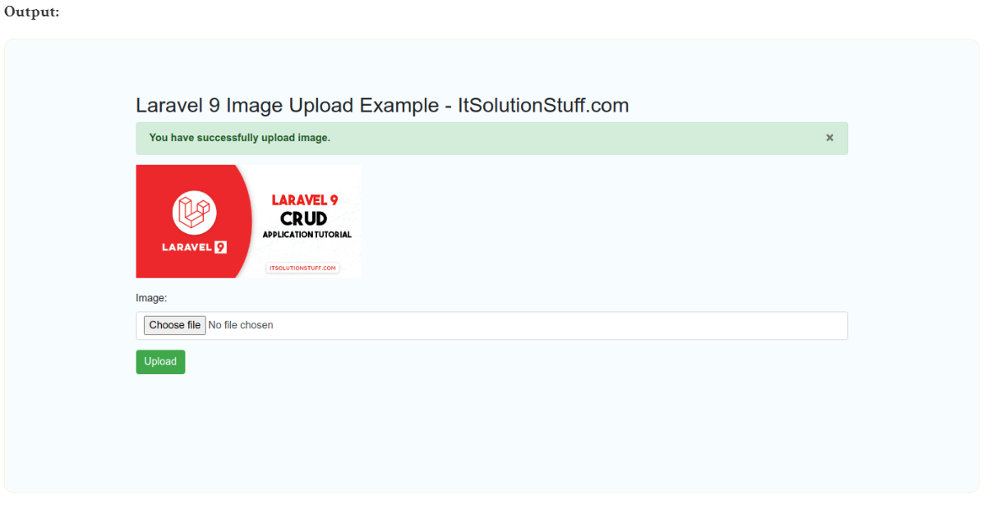

# Laravel9_Image_Upload
## 1. Install Laravel 9
- Tạo mới một project laravel;

```Dockerfile
composer create-project laravel/laravel laravel9_image_upload
```

## 2. Create Controller

```Dockerfile
php artisan make:controller ImageController
```

- Vào app/Http/Controllers/ImageController.php

```Dockerfile
<?php
  
namespace App\Http\Controllers;
  
use Illuminate\Http\Request;
  
class ImageController extends Controller
{
    /**
     * Display a listing of the resource.
     *
     * @return \Illuminate\Http\Response
     */
    public function index()
    {
        return view('imageUpload');
    }
      
    /**
     * Display a listing of the resource.
     *
     * @return \Illuminate\Http\Response
     */
    public function store(Request $request)
    {
        $request->validate([
            'image' => 'required|image|mimes:jpeg,png,jpg,gif,svg|max:2048',
        ]);
      
        $imageName = time().'.'.$request->image->extension();  
       
        $request->image->move(public_path('images'), $imageName);
    
        /* 
            Write Code Here for
            Store $imageName name in DATABASE from HERE 
        */
      
        return back()
            ->with('success','You have successfully upload image.')
            ->with('image',$imageName); 
    }
}
```
Lưu trữ hình ảnh trong thư mục lưu trữ(Storage Folder)

```Dockerfile
$request->image->storeAs('images', $imageName);
// storage/app/images/file.png
```

Lưu trữ Hình ảnh trong Thư mục Public 

```Dockerfile
$request->image->move(public_path('images'), $imageName);
// public/images/file.png
```
Lưu trữ hình ảnh trong S3
```Dockerfile
$request->image->storeAs('images', $imageName, 's3');
```
## 3. Create and Add Routes
routes/web.php

```Dockerfile
<?php
  
use Illuminate\Support\Facades\Route;
  
use App\Http\Controllers\ImageController;
  
/* 
|--------------------------------------------------------------------------
| Web Routes
|--------------------------------------------------------------------------
|
| Here is where you can register web routes for your application. These
| routes are loaded by the RouteServiceProvider within a group which
| contains the "web" middleware group. Now create something great!
|
*/
  
Route::controller(ImageController::class)->group(function(){
    Route::get('image-upload', 'index');
    Route::post('image-upload', 'store')->name('image.store');
});
```

## 4.Create Blade File
- Tạo imageUpload.blade.php trong resources/views/

```Dockerfile
<!DOCTYPE html>
<html>
<head>
    <title>Laravel 9 Image Upload Example - ItSolutionStuff.com</title>
    <link href="https://cdn.jsdelivr.net/npm/bootstrap@5.0.2/dist/css/bootstrap.min.css" rel="stylesheet">
</head>
      
<body>
<div class="container">
       
    <div class="panel panel-primary">
  
      <div class="panel-heading">
        <h2>Laravel 9 Image Upload Example - ItSolutionStuff.com</h2>
      </div>
 
      <div class="panel-body">
       
        @if ($message = Session::get('success'))
        <div class="alert alert-success alert-block">
            <button type="button" class="close" data-dismiss="alert">×</button>
                <strong>{{ $message }}</strong>
        </div>
        
        @endif
      
        <form action="{{ route('image.store') }}" method="POST" enctype="multipart/form-data">
            @csrf
  
            <div class="mb-3">
                <label class="form-label" for="inputImage">Image:</label>
                <input 
                    type="file" 
                    name="image" 
                    id="inputImage"
                    class="form-control @error('image') is-invalid @enderror">
  
                @error('image')
                    <span class="text-danger">{{ $message }}</span>
                @enderror
            </div>
   
            <div class="mb-3">
                <button type="submit" class="btn btn-success">Upload</button>
            </div>
       
        </form>
      
      </div>
    </div>
</div>
</body>
    
</html>
```

## 5. Chạy project

```Dockerfile
php artisan serve
```
-  Vào 
http://localhost:8000/image-upload


